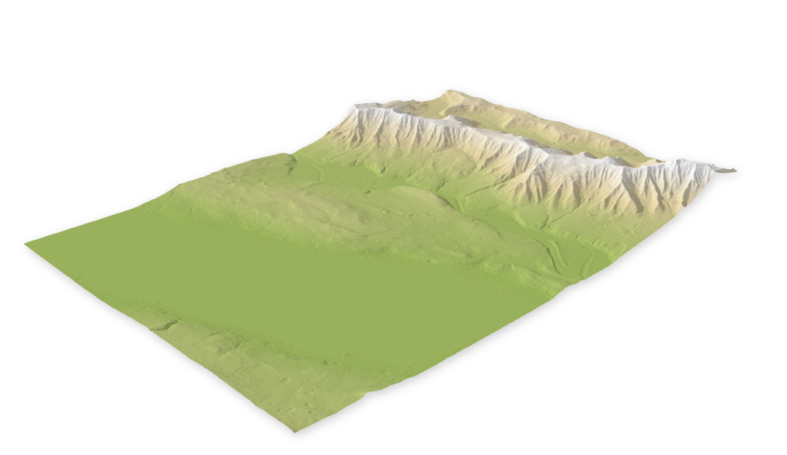
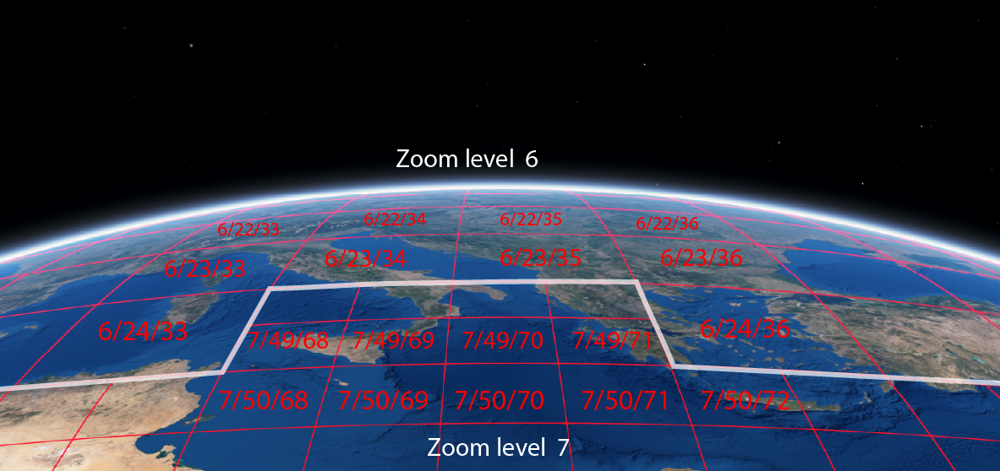
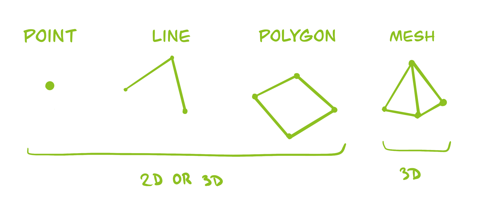
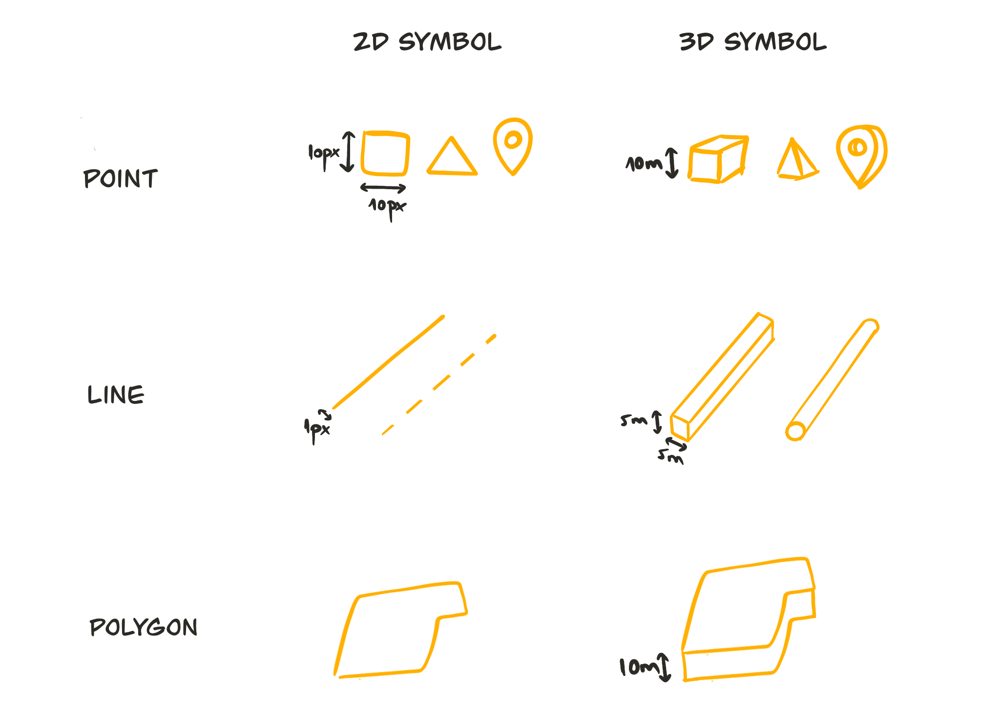
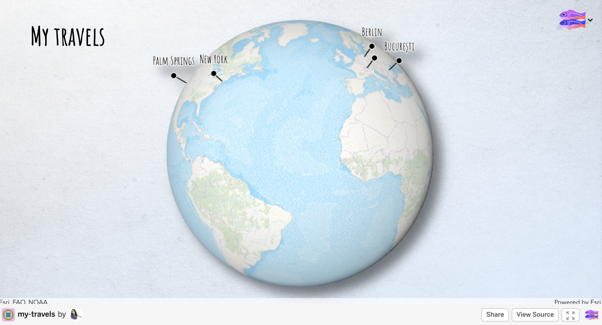

## Visualize the world in 3D

 
  Raluca Nicola - Product Engineer ArcGIS API for JavaScript

 <small>
International Master of Cartography - May 28, 2020
</small>

---

### About me
  

    <iframe data-src="../samples/locations_en.html" ></iframe>
  

---

### [ArcGIS API for JavaScript](https://developers.arcgis.com/javascript/)

Library for visualizing geospatial data in 2D and 3D on the web

---

### What does a product engineer do?

- Designs, tests and writes documentation for new features
- Makes demos and prototypes
- Answers questions from users
- Participates in conferences
- Writes blog posts

---

## Agenda

1. Basic concepts in 3D
  - Scene | Camera | Lighting | Types of data | Types of symbols
2. Tools for geospatial data visualization in 3D
3. Examples
4. Hands-on demo: create your first 3D map

---

## Basic concepts in 3D

---

---

### Scene

  

    
Local scene

    <iframe data-src="../samples/local-scene.html" ></iframe>
  

  

    
Global scene

    <iframe data-src="../samples/global-scene.html" ></iframe>
  

---

### Camera

   <video controls src="../images/camera.mp4" type="video/mp4" style="max-width: 70%"/>

---

### Light sources

---

<iframe data-src="../samples/daylight.html" ></iframe>

---

### Raster data

---

### Elevation surface

  

    
  

  

    
  

---

### Tiled raster data

---

### Vector data

---

### Point, line, polygon

  

<button class="play" id="relativeToGround"></button>
<pre><code class="lang-ts">
layer.elevationInfo = {
  mode: "relative-to-ground",
  offset: 200
}
</code></pre>

<button class="play" id="onTheGround"></button>
<pre><code class="lang-ts">
layer.elevationInfo = {
  mode: "on-the-ground"
}
</code></pre>

  

  

    <iframe data-src="../samples/vector-data.html"></iframe>
  

---

### Mesh data

<iframe data-src="../samples/berlin-palace.html"></iframe>

---

### Point cloud data

<iframe data-src="https://developers.arcgis.com/javascript/latest/sample-code/layers-pointcloud-size-density/live/index.html"></iframe>

---

### Types of symbols

---

### Tools for visualizing 3D geospatial data

Software:

[SceneViewer](https://www.arcgis.com/home/webscene/viewer.html) | [Mapbox Studio](https://www.mapbox.com/mapbox-studio/) | [KeplerGL](https://kepler.gl/)

Visualization libraries:

[ArcGIS API for JavaScript](https://developers.arcgis.com/javascript/) | [CesiumJS](https://cesium.com/cesiumjs/) | [MapboxGL](https://docs.mapbox.com/mapbox-gl-js/api/) | [DeckGL](https://deck.gl/#/) | [HarpGL](https://www.harp.gl/)

---

## Examples

---

### Urban planning

  <iframe frameborder="0" scrolling="no" allowfullscreen data-src="https://arcg.is/1yWDGn"></iframe>

---

### Ski resort map

  <iframe data-src="https://ralucanicola.github.io/ski-resort-map/"></iframe>

---

### 2019 earthquakes visualization

  <iframe data-src="https://ralucanicola.github.io/earthquakes-viz/"></iframe>

---

### Hiking map

  <iframe data-src="https://esri.github.io/hiking-trails-app/"></iframe>

---

### Globe of extremes

  <iframe data-src="https://ralucanicola.github.io/the-globe-of-extremes/"></iframe>

---

### A detailed building model

  <iframe data-src="https://esri.github.io/building-viewer"></iframe>

---

### Sketching buildings of San Francisco

  <iframe data-src="https://ralucanicola.github.io/JSAPI_demos/sanfranart/"></iframe>

---

## Questions? 🤔

 <small>
🐦 @nicolaraluk
 
 
📧 rnicola@esri.com
</small>

---

### Hands-on demo - [https://my-travels.glitch.me/](https://my-travels.glitch.me/)

