## Vizualizează lumea în 3D

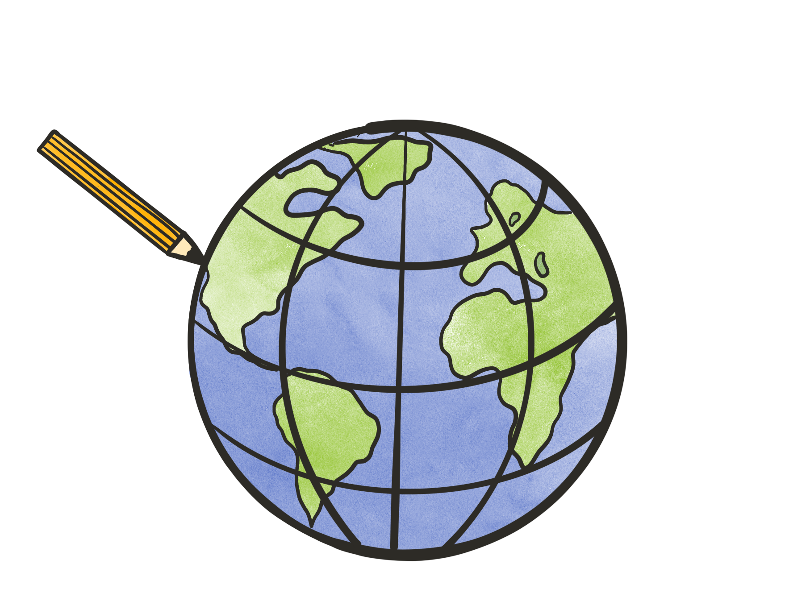

 
  Raluca Nicola - Product Engineer ArcGIS API for JavaScript

 <small>
Seminar Asociația Română de Cartografie, 8 Mai 2020
</small>

---

### Despre mine
  

    <iframe data-src="../samples/locations.html" ></iframe>
  

---

### [ArcGIS API for JavaScript](https://developers.arcgis.com/javascript/)

Bibliotecă de vizualizare online a datelor spațiale în 2D și 3D

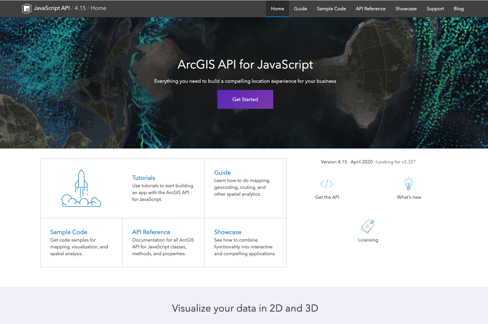

---

### Ce implică munca de product engineer?

- Design și specificație pentru un nou feature (de exemplu un nou tip de simbol)
- Testare și documentație a feature-ului
- Demo-uri si prototipuri
- Răspunsuri la întrebările utilizatorilor (forum, medii sociale, mail)
- Participare la conferințe
- Bloguri

---

## Agendă

1. Concepte de bază în 3D
  - Scena | Camera | Iluminare | Tipuri de date | Tipuri de simboluri
2. Instrumente de vizualizare de date geospațiale 3D online
3. Exemple de vizualizări
4. Hands-on demo: creează prima hartă 3D

---

## Concepte de bază în 3D

---

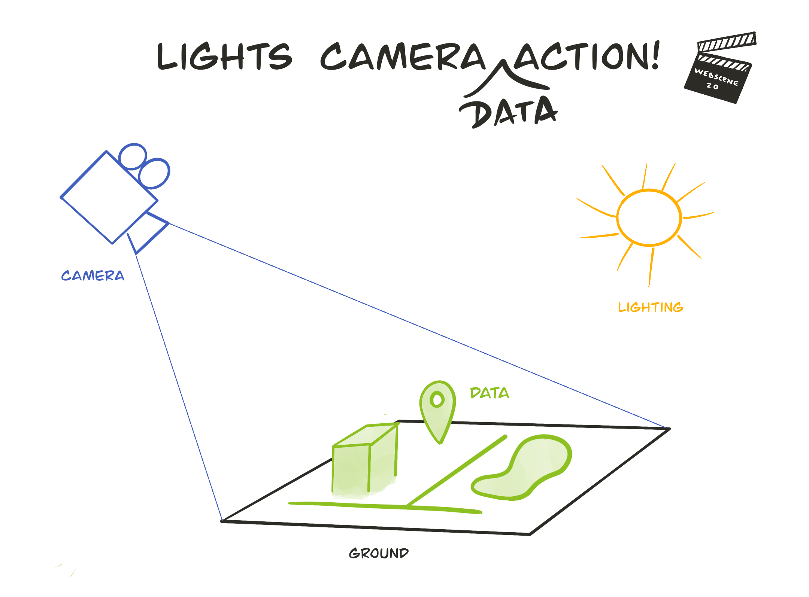

---

### Scena

  

    
Scenă proiectată

    <iframe data-src="../samples/local-scene.html" ></iframe>
  

  

    
Glob

    <iframe data-src="../samples/global-scene.html" ></iframe>
  

---

### Camera

   <video controls src="../images/camera.mp4" type="video/mp4" style="max-width: 70%"/>

---

### Surse de lumină

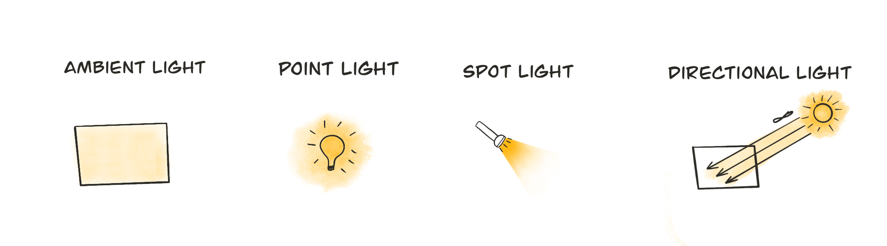

---

<iframe data-src="../samples/daylight.html" ></iframe>

---

### Tipuri de date

---

### Date raster

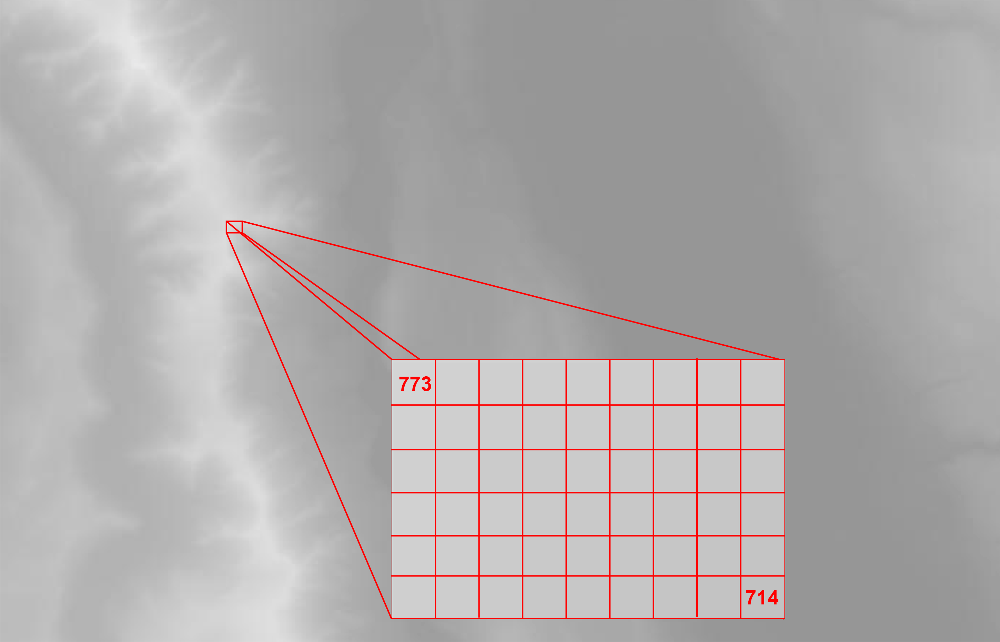

---

### Suprafață de teren

  

    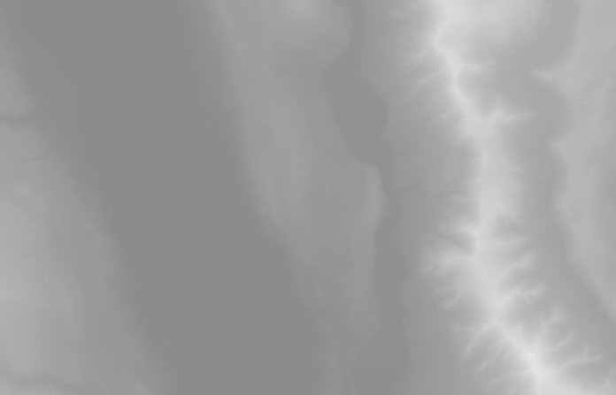
  

  

    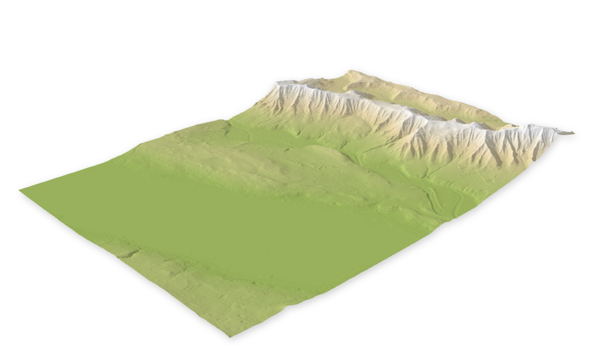
  

---

### Date raster tiled

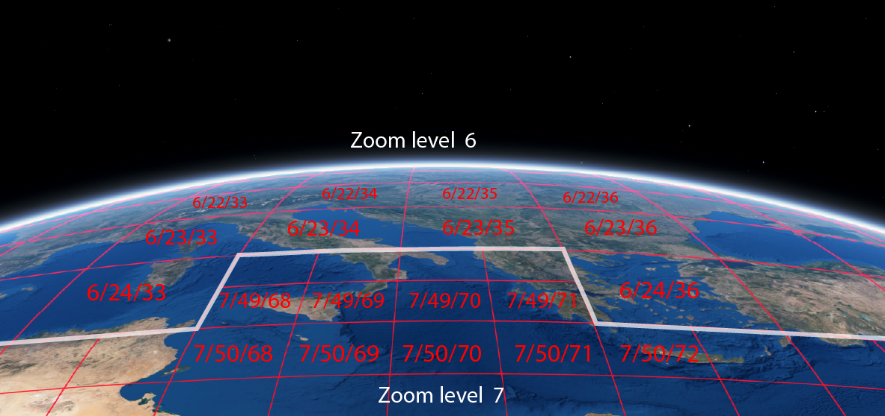

---

### Date vector

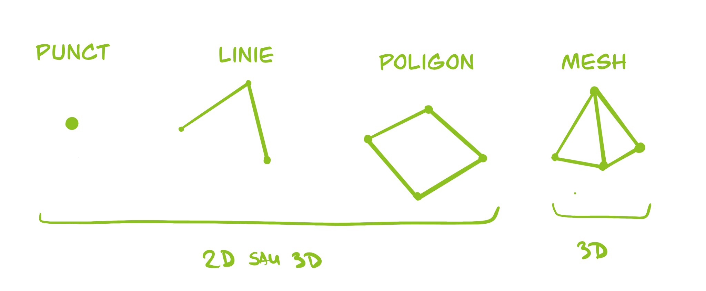

---

### Punct, linie, poligon

  

<button class="play" id="relativeToGround"></button>
<pre><code class="lang-ts">
layer.elevationInfo = {
  mode: "relative-to-ground",
  offset: 200
}
</code></pre>

<button class="play" id="onTheGround"></button>
<pre><code class="lang-ts">
layer.elevationInfo = {
  mode: "on-the-ground"
}
</code></pre>

  

  

    <iframe data-src="../samples/vector-data.html"></iframe>
  

---

### Date de tip mesh

<iframe data-src="../samples/berlin-palace.html"></iframe>

---

### Point cloud

<iframe data-src="https://developers.arcgis.com/javascript/latest/sample-code/layers-pointcloud-size-density/live/index.html"></iframe>

---

### Tipuri de simboluri

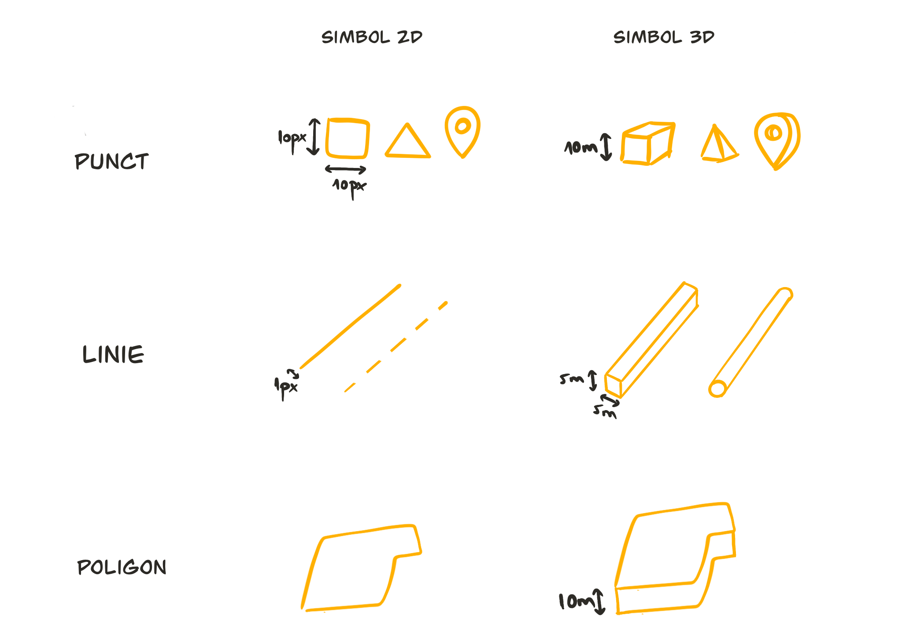

---

### Software pentru vizualizare web 3D

Software:

[SceneViewer](https://www.arcgis.com/home/webscene/viewer.html) | [Mapbox Studio](https://www.mapbox.com/mapbox-studio/) | [KeplerGL](https://kepler.gl/)

Biblioteci de vizualizare:

[ArcGIS API for JavaScript](https://developers.arcgis.com/javascript/) | [CesiumJS](https://cesium.com/cesiumjs/) | [MapboxGL](https://docs.mapbox.com/mapbox-gl-js/api/) | [DeckGL](https://deck.gl/#/) | [HarpGL](https://www.harp.gl/) | [Potree](http://potree.org/) | [ThreeJS]()

---

## Exemple

---

### Planificare urbană

  <iframe frameborder="0" scrolling="no" allowfullscreen data-src="https://arcg.is/1yWDGn"></iframe>

---

### Hartă a unei stațiuni de ski

  <iframe data-src="https://ralucanicola.github.io/ski-resort-map/"></iframe>

---

### Vizualizare de cutremure în 2019

  <iframe data-src="https://ralucanicola.github.io/earthquakes-viz/"></iframe>

---

### Hartă de drumeții montane

  <iframe data-src="https://esri.github.io/hiking-trails-app/"></iframe>

---

### Globul extremelor

  <iframe data-src="https://ralucanicola.github.io/the-globe-of-extremes/"></iframe>

---

### Model 3D detaliat al unei clădiri - date BIM

  <iframe data-src="https://esri.github.io/building-viewer"></iframe>

---

### Vizualizare schiță a clădirilor din San Francisco

  <iframe data-src="https://ralucanicola.github.io/JSAPI_demos/sanfranart/"></iframe>

---

### Hands-on demo - [https://my-travels.glitch.me/](https://my-travels.glitch.me/)

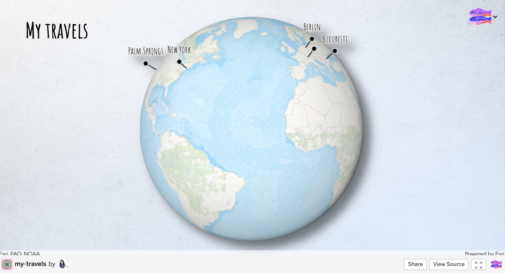

<small>
Instrucțiuni video (în engleză):  https://www.youtube.com/watch?v=rqe2aRbpTGY
</small>

---

## Întrebări? 🤔

 <small>
Versiune live a prezentării:  https://raluca-nicola.net/intro-3D-geoviz/ro
</small>

